## Tuesday

- [ ] Deploy[^1] all components to production[^2].
  - [ ] Deploy [Authentication] to production.
  - [ ] Deploy [Resource Registry] to production.
  - [ ] Deploy [^4] Auditlog to production.
- [ ] Deploy updates to APIM (if updated since last deploy)
  - [ ] Check [apim deploys to tt](https://dev.azure.com/brreg/altinn-studio-ops/_build?definitionId=125) for updates to `#resourceregistry` and `#authentication`. If none of them have been deployed the last week, no change needed.
- [ ] Go grab a coffee
- [ ] Post-deploy[^3] all components in production.
  - [ ] Post-deploy [Authentication] after checking [aks workloads](https://portal.azure.com/#view/Microsoft_Azure_ContainerService/AksK8ResourceMenuBlade/~/overview-DaemonSet/aksClusterId/%2Fsubscriptions%2F1ab2d164-1861-4ff8-be8c-069c3ee3b70a%2FresourceGroups%2Faltinnplatform-prod-rg%2Fproviders%2FMicrosoft.ContainerService%2FmanagedClusters%2Fplatform-prod-01-aks/resource~/%7B%22kind%22%3A%22DaemonSet%22%2C%22metadata%22%3A%7B%22name%22%3A%22altinn-authentication%22%2C%22namespace%22%3A%22default%22%2C%22uid%22%3A%225cbb20dd-8091-40a3-8b6f-215dc83663f7%22%7D%2C%22spec%22%3A%7B%22selector%22%3A%7B%22matchLabels%22%3A%7B%22app%22%3A%22altinn-authentication%22%2C%22release%22%3A%22altinn-authentication%22%7D%7D%7D%7D).
  - [ ] Post-deploy [Resource Registry] after checking [aks workloads](https://portal.azure.com/#view/Microsoft_Azure_ContainerService/AksK8ResourceMenuBlade/~/overview-DaemonSet/aksClusterId/%2Fsubscriptions%2F1ab2d164-1861-4ff8-be8c-069c3ee3b70a%2FresourceGroups%2Faltinnplatform-prod-rg%2Fproviders%2FMicrosoft.ContainerService%2FmanagedClusters%2Fplatform-prod-01-aks/resource~/%7B%22kind%22%3A%22DaemonSet%22%2C%22metadata%22%3A%7B%22name%22%3A%22altinn-resource-registry%22%2C%22namespace%22%3A%22default%22%2C%22uid%22%3A%2228ea9595-db6c-4b9a-af6d-f3597bdec99d%22%7D%2C%22spec%22%3A%7B%22selector%22%3A%7B%22matchLabels%22%3A%7B%22app%22%3A%22altinn-resource-registry%22%2C%22release%22%3A%22altinn-resource-registry%22%7D%7D%7D%7D).
  - [ ] Post-deploy of auditlog, verify containerapp[^6] and functionapp[^7]. You can navigate to the function app and container app from [here](https://portal.azure.com/#@ai-dev.no/resource/subscriptions/dd6d3e08-a70f-4f71-8847-781ddc5d8468/resourceGroups/auditlog-prod-rg/overview)

## Wednesday

- [ ] Deploy[^1] all components to TT02.
  - [ ] Deploy [Authentication] to TT02.
  - [ ] Deploy [Resource Registry] to TT02.
  - [ ] Deploy [^5] Auditlogto TT02.
- [ ] Deploy updates to APIM (if updated since last deploy)
  - [ ] Check [apim deploys to at](https://dev.azure.com/brreg/altinn-studio-ops/_build?definitionId=124) for updates to `#resourceregistry` and `#authentication`. If none of them have been deployed the last week, no change needed.
- [ ] Go grab a coffee
- [ ] Post-deploy[^3] all components in TT02.
  - [ ] Post-deploy [Authentication] after checking [aks workloads](https://portal.azure.com/#view/Microsoft_Azure_ContainerService/AksK8ResourceMenuBlade/~/overview-DaemonSet/aksClusterId/%2Fsubscriptions%2Fdd6d3e08-a70f-4f71-8847-781ddc5d8468%2FresourceGroups%2Faltinnplatform-tt02-rg%2Fproviders%2FMicrosoft.ContainerService%2FmanagedClusters%2Fplatform-tt02-02-aks/resource~/%7B%22kind%22%3A%22DaemonSet%22%2C%22metadata%22%3A%7B%22name%22%3A%22altinn-authentication%22%2C%22namespace%22%3A%22default%22%2C%22uid%22%3A%2230435626-9bfa-4c59-8982-2c67f5e12236%22%7D%2C%22spec%22%3A%7B%22selector%22%3A%7B%22matchLabels%22%3A%7B%22app%22%3A%22altinn-authentication%22%2C%22release%22%3A%22altinn-authentication%22%7D%7D%7D%7D).
  - [ ] Post-deploy [Resource Registry] after checking [aks workloads](https://portal.azure.com/#view/Microsoft_Azure_ContainerService/AksK8ResourceMenuBlade/~/overview-DaemonSet/aksClusterId/%2Fsubscriptions%2Fdd6d3e08-a70f-4f71-8847-781ddc5d8468%2FresourceGroups%2Faltinnplatform-tt02-rg%2Fproviders%2FMicrosoft.ContainerService%2FmanagedClusters%2Fplatform-tt02-02-aks/resource~/%7B%22kind%22%3A%22DaemonSet%22%2C%22metadata%22%3A%7B%22name%22%3A%22altinn-resource-registry%22%2C%22namespace%22%3A%22default%22%2C%22uid%22%3A%228a2dca87-471b-47a8-899c-817b6fd7ea70%22%7D%2C%22spec%22%3A%7B%22selector%22%3A%7B%22matchLabels%22%3A%7B%22app%22%3A%22altinn-resource-registry%22%2C%22release%22%3A%22altinn-resource-registry%22%7D%7D%7D%7D).
  - [ ] Post-deploy of auditlog, verify containerapp[^6] and functionapp[^7]. You can navigate to the function app and container app from [here](https://portal.azure.com/#@ai-dev.no/resource/subscriptions/dd6d3e08-a70f-4f71-8847-781ddc5d8468/resourceGroups/auditlog-prod-rg/overview)

## Thursday

#### Go through all github pull-requests from the dependency bots in all repos.

- [ ] [Authentication](https://github.com/Altinn/altinn-authentication).
- [ ] [Authentication UI](https://github.com/Altinn/altinn-authentication-frontend).
- [ ] [Resource Registry](https://github.com/Altinn/altinn-resource-registry).
- [ ] [Auditlog](https://github.com/Altinn/altinn-auth-audit-log)

[Authentication]: https://dev.azure.com/brreg/altinn-studio/_release?_a=releases&view=all&definitionId=20
[Resource Registry]: https://dev.azure.com/brreg/altinn-studio/_release?_a=releases&view=all&definitionId=36
[Auditlog]: https://github.com/Altinn/altinn-auth-audit-log/actions/workflows/deploy-after-release.yml

[^1]: Approve pending prod releases by clicking the blue production chip and clicking approve. 
[^2]: Look for any blue production chips. 
[^3]: This is done after checking that everything is running as it should.  
[^4]: Check if there are any awaiting deployments to production for [Auditlog]  
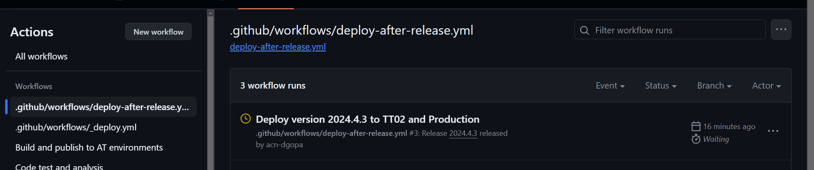  
Click on the awaiting deployment. You can see that a deployment to TT02 was successfull last week. Click on Review deployments   
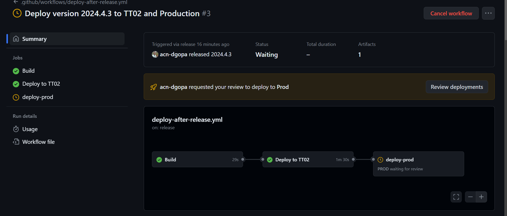  
Click on the prod checkbox and then click approve and deploy. This will trigger a deployment to production.  
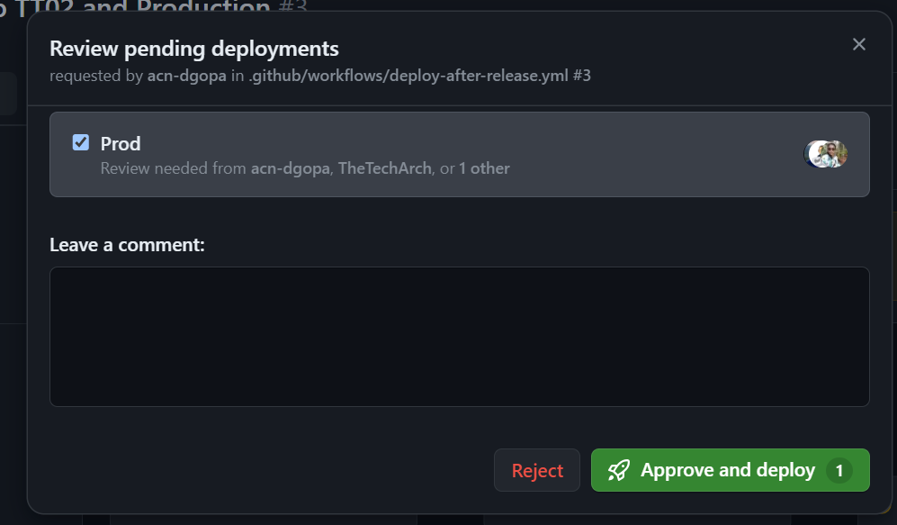  
[^5]: The new components are deployed via github actions. For auditlog, a release is scheduled every wednesday. Go to https://github.com/Altinn/altinn-auth-audit-log/releases and check if there are any draft release is found.  
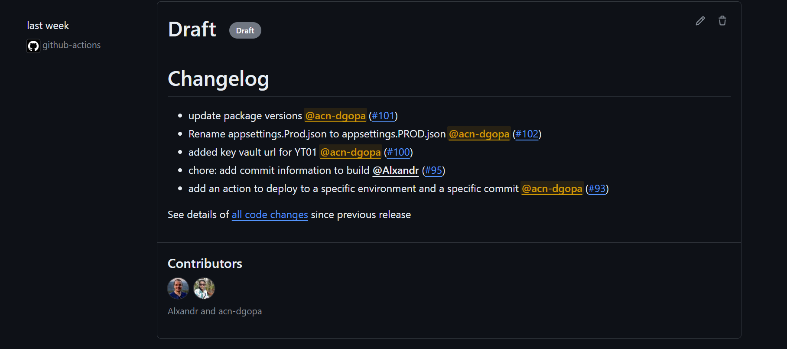  
click on Edit Draft and set the release title as the tag version f.eks in the picture you can see that the tag is 2024.4.3 and the release title therefore should be set as 2024.4.3.  
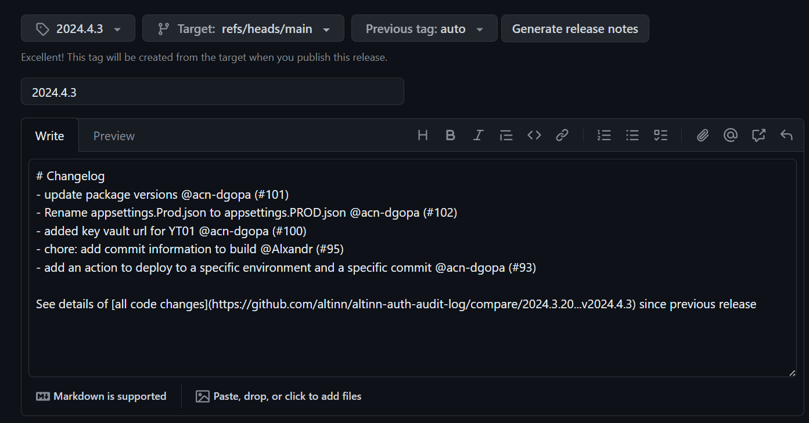  
Scroll down and you will find the button "Publish Release"  
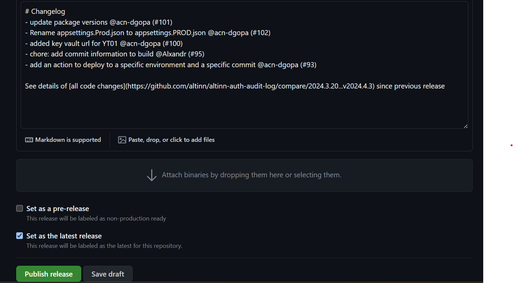  
once the publish release is clicked, release notes will be published and a deploy will be triggered to TT02.  
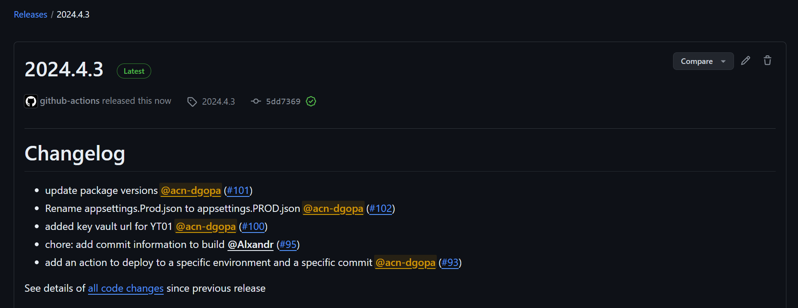  
You can see that the deploy is triggered and the approvers are notified about the awaiting deployment of [Auditlog]  
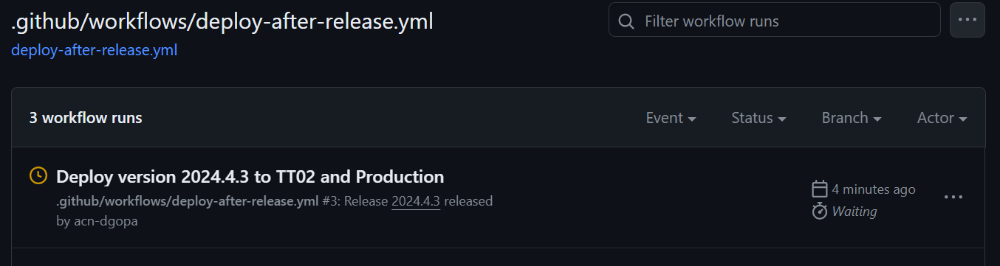  
Click on the awaiting deployment  
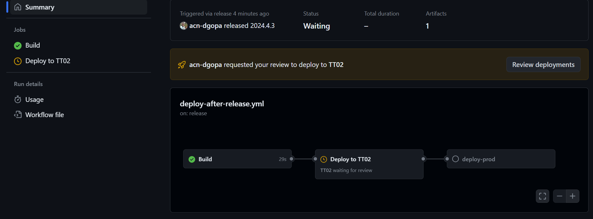  
Click on review deployments. Click the tt02 checkbox and click approve and deploy button  
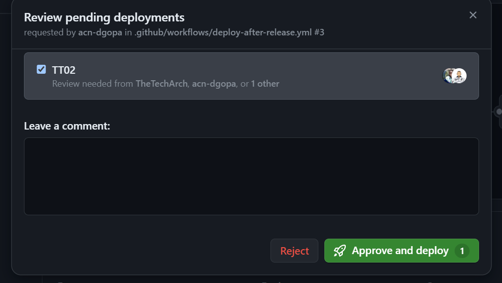  
Now you can see that a deployment is triggered to TT02  
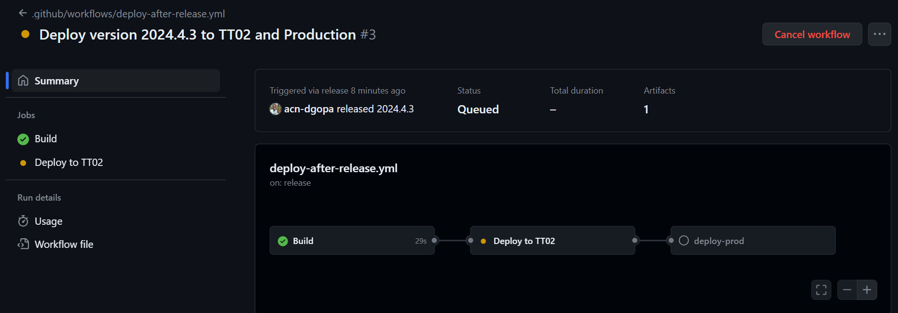  
Once the package is successfully deployed to TT02, you can see that a deployment to production is triggered. This will be approved by the deployer on the following Tuesday  
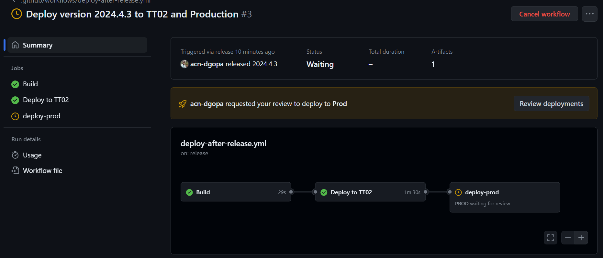  
[^6]: Verify that the newly deployed package has the right image tag 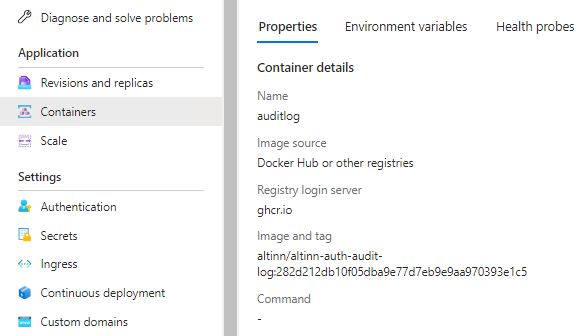  
Check the provisioning status in the container apps overview page  
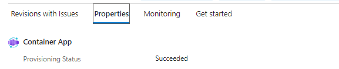  
[^7]: Verify the function app deployment status in the deployment logs in deployment center of the function app  
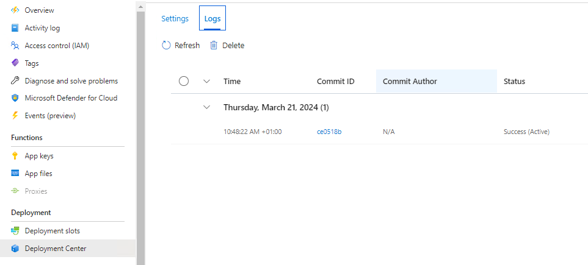
